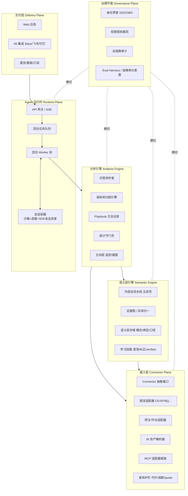

# 企业数据分析 Agent — 完整架构设计方案

> 版本 v1.0 · 2026-07 · 本文档为完整版设计，实现落地阶段的优先级见第 13 章，但所有模块边界与接口契约按完整版预留。

---

## 1. 产品定位与核心设计原则

### 1.1 定位

面向企业的数据分析 Agent SaaS：接入企业已有数据体系（数仓/ClickHouse/数据中台/BI 资产），以自然语言完成"查数 → 归因 → 主动洞察 → 交付报告"的完整分析闭环。可选垂直切入场景：CX/客服数据分析。

### 1.2 六条设计铁律（所有模块设计的最高约束）

| # | 铁律 | 含义 |
|---|------|------|
| P1 | **可验证性是人工构造出来的** | 业务领域没有编译器，语义层 + 指标树 + 统计守门员 + eval 集就是我们造的"编译器" |
| P2 | **失败必须表现为拒答，不能表现为自信的错数** | 置信度不足时明确说"不确定/需要澄清"，一次错数的代价是信任崩塌 |
| P3 | **LLM 永远不是权限边界** | 权限执行在数据库/网关层，以真实用户身份执行；agent 只负责聪明，不负责守门 |
| P4 | **回合（turn）是运行时的原子单位** | 会话建模为一串顺序回合任务，不建模为长连接绑定 |
| P5 | **护城河资产必须模型无关** | 语义层、指标树、playbook、eval 集全部为数据/配置资产，不与任何 LLM 绑定 |
| P6 | **顺着企业治理接入，不绕开它** | 复用企业已有的权限体系、中台 API、BI 资产；治理越好的企业接入越快 |

### 1.3 差异化主战场（每项的"极致标准"见第 12 章）

1. 起步快、可持续迭代的**语义化能力**（冷启动自动化 + 学习飞轮）
2. 企业数据**接入便捷性**（三模式 + 适配器插件化 + 接入 SOP）
3. **分析能力**（指标树归因引擎 —— 市面公认空白）
4. **权限**（四层防线 + agent 特有风险防御）
5. **分布式 session**（回合任务模型 + 会话容器）
6. **记录跟踪**（全链路审计 + 客户可见的准确率仪表盘）

---

## 2. 总体架构



**六个平面、单向依赖**：交付层 → 运行时 → 分析引擎 → 语义层 → 接入层；治理平面横切所有层。任何反向依赖视为架构违规。

---

## 3. 模块一：企业接入层（Connector Plane）

> 目标：外部接入完全抽象化。上层（语义层/分析引擎）永远只面对统一接口，看不到任何具体数据源。

### 3.1 Connector 抽象接口（核心契约）

任何数据源适配器必须实现四个接口（这也是 MCP 适配器的协议基础）：

```python
class Connector(Protocol):
    # 1. 查询执行：以指定用户身份执行，返回 Arrow 格式结果
    async def execute(self, query: Query, identity: UserIdentity,
                      guard: GuardPolicy) -> QueryResult: ...

    # 2. 元数据：表/列/类型/注释/统计信息（供 profiling 与语义层）
    async def get_metadata(self, scope: MetadataScope) -> CatalogSnapshot: ...

    # 3. 查询历史：历史 SQL + 执行者 + 扫描量（语义层冷启动的核心输入）
    async def get_query_history(self, window: TimeWindow) -> Iterator[HistoricalQuery]: ...

    # 4. 权限校验：给定身份对给定对象的可见性判定（回调企业权限体系）
    async def check_access(self, identity: UserIdentity,
                           objects: list[DataObject]) -> AccessDecision: ...
```

要点：

- `Query` 是中间表示（IR），不是裸 SQL 字符串。由方言层（SQLGlot）在适配器内部转译为目标方言（ClickHouse/Snowflake/BigQuery/中台 API 调用）。
- `identity` 强制传入，无身份不执行（铁律 P3）。
- `guard` 强制传入，护栏不可绕过（见 3.4）。

### 3.2 三种接入模式（同一接口的三类实现）

| 模式 | 适用企业 | 实现要点 |
|------|---------|---------|
| **直连模式** | 允许开只读账号 | 原生驱动直连；CK 场景当天可拉 `system.query_log` 启动语义层冷启动 |
| **网关/中台模式** | 有数据中台/查询平台/OneService | `execute` 转译为中台 API 调用；中台指标目录直接导入语义层；权限天然复用中台 |
| **BI 资产模式** | 有帆软/QuickBI/Superset/Metabase | 数据集解析器：每个 BI 数据集 = 已验证的 join+口径封装，导入即得高质量语义层素材 |

实际落地为混合：BI 数据集导入建语义层 + 直连/网关执行 + query_log 持续挖掘。

### 3.3 MCP 适配器框架（接入成本外置）

- 公开发布 Connector 四接口的 MCP Server 规范与脚手架。
- 企业平台团队将自家内部系统（自研查询平台、权限中心）包装为 MCP server，即插即用。
- 战略意义：长尾接入工作从我方交付成本 → 企业平台团队的一次性顺手工作。

### 3.4 查询护栏（GuardPolicy — 打动 DBA 的第一页 PPT）

- 执行前代价预估（EXPLAIN / 扫描量估算），超阈值拒绝或降级采样。
- 强制分区裁剪与 LIMIT 注入；禁止无谓大 join（CK 环境优先路由宽表/物化视图）。
- 独立资源队列 + 租户级 quota；慢查询熔断；并发上限。
- 承诺话术："agent 永远打不挂你的集群"，护栏配置对客户透明可查。

### 3.5 方言与路由

- SQLGlot 做统一 IR ↔ 各方言转译与语法校验（生成后先本地 parse 验证再发出）。
- 粒度路由：同一指标在明细表/聚合表/物化视图的多绑定，按问题粒度自动选最便宜的表。

---

## 4. 模块二：语义层引擎（Semantic Engine）

> 目标：接入分钟级出草稿、使用中自动增厚、客户离开时带不走。这是全产品最深的护城河。

### 4.1 数据模型

语义层的原子单位是**业务概念**，不是表/列：

```yaml
entity: 客户
canonical_key: customer_id
aliases: [客户, 会员, 买家, cust, client]      # 含业务黑话
bindings:                                      # 概念 → 物理落点（多绑定）
  - {table: orders, column: cust_no, grain: order}
  - {table: crm_contacts, column: client_code, grain: customer}
join_paths:
  - {expr: "orders.cust_no = crm_contacts.client_code",
     evidence: query_log, confidence: 0.98}
enum_mappings:                                 # 值级归一
  - {concept: 支付状态, mappings: {orders.status: {1: paid, 2: pending}}}
semantic_roles:                                # 语义角色而非数据类型
  - {column: orders.pay_date, role: 支付日期}

metric: GMV
definition: "已支付订单金额汇总，含退款，排除测试账号"
expr: "SUM(orders.amount) WHERE orders.status = 'paid' AND is_test = 0"
grain: [day, channel, category]
verified: true                                 # 人工确认标记
restricted: false                              # 权限分区（公共层/受限层）
version: 3                                     # 全量版本化
```

补充结构：**反例库**（"这两列不能 join"与被纠正过的错误口径，与正例同等权重）、**verified answers 库**（问题→SQL→答案三元组，命中即复用模板、重执行取数）。

### 4.2 冷启动流水线（五信号，按信息密度排序）

| 优先级 | 信号源 | 说明 |
|--------|--------|------|
| 1 | **查询日志挖掘** | 解析历史 SQL → 聚类 → 提取真实 join 路径/过滤惯例/指标表达式。CK 的 `system.query_log` 开箱即得 |
| 2 | **存量建模资产导入** | dbt models+metrics、LookML、BI 数据集解析器 —— 白捡客户已付费的建模成果 |
| 3 | **Schema profiling** | 采样值分布、枚举检测、主外键推断、join graph、null 率 |
| 4 | **文档/协作工具** | 数据字典、wiki、IM 中口径讨论 |
| 5 | **LLM 推断兜底** | 80% 自动生成 + 人审 20% |

### 4.3 证据图与实体归一

- 列为节点、证据为带权边的图；聚类成概念簇。
- 四类证据强度：查询日志 join 条件（判决性）＞ 值域包含度/格式模式 ＞ 血缘/ETL 同源 ＞ 列名 embedding 相似（仅做候选召回，不做判决）。
- **归一粒度是 `(表, 列)` 二元组**，防"同名不同义"（orders.status ≠ users.status）。
- 置信度三层处理：高置信自动合并；中置信进确认队列；**低置信不猜**（铁律 P2）。

### 4.4 确认队列 UX（"考试式"，不是丢 YAML）

- 按查询日志幂律排序：最常查的 20 个指标最先确认。
- 全部选择题："GMV 我发现两种算法：含退款/不含退款，标准口径是？"
- 目标：客户 30 分钟点完，覆盖 80% 日常提问。

### 4.5 学习回路（热运行飞轮）

1. **澄清即沉淀**：歧义反问的答案自动写入，同一问题全团队永远只问一次。
2. **纠正即训练**：用户纠正版本化写回 + 自动冲突回归检查。
3. **冲突显式化**：跨部门口径矛盾暴露给数据负责人裁决（顺手提供口径治理价值）。
4. **verified answers 生长**：确认过的答案入库，作为后续相似问题的锚点。

### 4.6 开放性

- 兼容 dbt semantic layer / MetricFlow 格式，支持随时导出（"不锁定"降低采用门槛）。
- 真正带不走的是：证据图判决历史、反例库、verified 历史、确认记录 —— 飞轮本身。

---

## 5. 模块三：分析引擎（Analysis Engine）

> 定位：交付的不是"能查数的工具"，而是"一个分析师的思考过程"。

### 5.1 基础问答（四件套）

每次回答 = **数字 + 图 + 口径声明 + 业务解读**。口径声明消费语义层沉淀（信任的日常展示窗口）；解读是可直接转发给老板的一段话。对话连续性（"那上海呢？""按周看呢？"）为一等公民。

### 5.2 指标树归因引擎（产品心脏，公认市场空白）

```
GMV = 流量 × 转化率 × 客单价
        ├── 流量 = Σ 各渠道流量
        ├── 转化率 = 下单数/访问数（按品类可分解）
        └── 客单价 = ...
```

- 每个节点绑定语义层指标；"为什么跌了" = **树上的结构化搜索**：逐层分解 → 贡献度计算排序 → 最大分支下钻 → 定位叶子。
- 产出带证据链的诊断报告：结论、贡献度排序、每步数据引用。
- 指标树同走冷启动+确认+学习飞轮（从查询日志和报表结构生成草稿）。
- 设计本质：归因从"LLM 自由发挥"变为"结构化搜索 + LLM 解读"，每步可验证（铁律 P1）。

### 5.3 Playbook 方法论库（垂直化抓手）

- 场景套路：留存/流失、漏斗诊断、同期群、大促复盘、A/B 判读、RFM 分层…
- 每个 playbook = 固定分析步骤 + 图表组合 + 解读框架；识别问题类型后按套路执行。
- CX 垂直包：工单量异常诊断、知识库缺口分析、客服绩效归因。
- 工程形态：声明式配置（YAML/DSL）+ 可插拔注册，垂直深度沉淀在 playbook 层，引擎保持通用。

### 5.4 统计守门员

自动执行并在输出中显式标注：显著性检验（"差异不显著，可能是噪声"）、小样本警告、季节性调整、辛普森悖论检测、均值回归提示。这是产品替业务用户挡住"被数据骗"的层。

### 5.5 主动层

- 指标树关键节点 7×24 监控 → 异常自动触发归因引擎 → 推送**带诊断结论的简报**（不是裸告警）。
- 定时晨报（习惯回路）。
- 实现上复用回合任务模型："没有用户消息的回合"，同队列同链路（见第 7 章）。

### 5.6 交付层

- 一键分析 → 可分享报告页（数据+图+结论+口径）。
- 高频问题固化为自动更新看板。
- 分享可被接收者继续追问（以接收者权限重新执行，见 6.3）。
- 团队历史分析可检索复用 → 组织分析中枢。

---

## 6. 模块四：权限与安全（Governance Plane）

### 6.1 四层防线

| 层 | 机制 |
|----|------|
| 身份贯穿 | 每查询以真实用户身份执行：数仓 OBO/OAuth 代理 ＞ 每用户凭证 ＞ service account + session context 绑定。禁止全能账号 |
| 数据库原生执行 | 表/列 RBAC、行级安全、列脱敏全部下沉数仓原生机制；复用客户已有权限体系，不再造 |
| 语义层权限感知 | 元数据本身是敏感信息：低权限用户的上下文中**不包含**无权对象；回答"没有找到相关数据"而非"你无权访问 X"（后者即泄露）。verified answer 复用 = 复用 SQL 模板 + 以提问者身份重执行，绝不复用缓存结果 |
| 全链路审计 | 见第 8 章 |

### 6.2 Agent 特有风险防御

1. **聚合推理越权**：敏感域最小聚合行数（<N 行拒答）+ 同用户连续查询差分审计。
2. **数据内容 prompt 注入**：查询结果只作为数据渲染，永不作为指令解析；结果解读与行动决策隔离。
3. **记忆跨权限泄露**：语义层沉淀分"公共层/受限层"权限分区写入。
4. **数据流向模型 API**：默认最小化（agent 尽量只见 schema/统计摘要/小样本，大结果集直接渲染给用户不回流模型）+ 零数据保留的企业级 API 协议 + 金融/医疗客户 VPC 部署选项。产出一页纸《数据流向说明》。

### 6.3 渐进授权（信任的阶梯）

默认姿态：只读、白名单表、敏感列排除、聚合优先于明细。管理员控制台逐步放开，每次扩权显式操作并可见"扩权后新增哪些能力"。与准确率飞轮同节奏：先在一两张核心表打到 95%+ 再扩。

---

## 7. 模块五：Agent 运行时（Runtime Plane）

### 7.1 状态三分法

| 状态 | 生命周期 | 归宿 |
|------|---------|------|
| 持久状态（对话历史/SDK会话文件/语义沉淀） | 跨回合跨天 | Postgres + 对象存储，绝不依赖本地盘 |
| 回合内状态（agent loop/工具中间结果/流缓冲） | 单回合 | Worker 内存 + 检查点 |
| 运行时资源（Python 沙箱/数仓连接/临时文件） | 有亲和性可重建 | 会话容器 + 闲置休眠 |

### 7.2 回合任务模型（铁律 P4）

```
用户消息 → 入队(session_id) → worker 抢占
  → 加载会话状态(外部存储) → 执行 agent loop
  → token 发布 pub/sub → 回合结束写回状态 → 释放锁
```

- **会话级串行锁**：同 session 同时仅一个回合在执行（Redis 分布式锁 / per-key 有序消费）；session 间完全并行，扩容 = 加 worker。
- **流式解耦**：worker 发布 `session:{id}` 频道（Redis Streams/NATS），任意网关节点订阅后 SSE 推送。断网重连接续看；关页面任务照跑（归因动辄 1–2 分钟，刚需）。
- **检查点 + 租约**：worker 心跳持有租约；挂掉则任务回队列从检查点重跑。产品动作几乎全只读 → 重跑天然幂等；少数写动作（保存报告/推送）加幂等键。

### 7.3 会话容器

- 会话首次活跃拉起轻量容器：沙箱 + 以该用户身份的数仓连接 + Agent SDK 会话目录。
- 亲和性仅是性能优化，**不是正确性依赖**：容器挂 → 对象存储恢复会话目录 → 异地重建。
- 闲置 N 分钟：目录快照至对象存储 → 容器销毁（成本归零）→ 回来按需水合。

### 7.4 主动任务复用

晨报/异常归因 = 无用户消息的回合任务，同队列同执行链路，不另建调度系统。部署上仅为一个 CronJob 向同一队列投递，无独立执行体系。

### 7.5 部署态（Deployment Topology）

```
浏览器 / IM Bot
      │ HTTPS / SSE
┌─────▼──────────────────────────────────────────┐
│ 无状态层（K8s Deployment + HPA，随 QPS 扩缩）      │
│  api-gateway (FastAPI ×N)      web 前端(CDN)    │
└─────┬──────────────────────────▲───────────────┘
      │ 回合入队                   │ 订阅 token 流
┌─────▼──────────────────────────┴───────────────┐
│ Redis：回合队列 / 会话串行锁 / Streams(流式频道)    │
└─────┬──────────────────────────▲───────────────┘
      │ 调度                      │ 发布 token
┌─────▼────────────┐             │
│ session-controller│  创建/唤醒/回收
│ (会话容器编排器)    │─────────┐   │
└──────────────────┘         │   │
┌────────────────────────────▼───┴───────────────┐
│ 会话容器池（每个活跃会话一个 Pod，动态创建）          │
│  agent-runner：SDK agent loop + 会话目录          │
│  Python 沙箱 │ 数仓连接(以用户身份) │ 护栏          │
└───┬──────────────────┬─────────────────────────┘
    │ 快照/水合          │ 查询（经 GuardPolicy）
┌───▼─────────┐  ┌─────▼──────────────────────┐
│ 对象存储(S3) │  │ 企业数据源/中台 API/LLM API   │
└─────────────┘  └────────────────────────────┘
  Postgres：语义层 / 元数据 / 审计（各层写入）
```

**部署决策 D1 — agent loop 住在会话容器内**：7.2 的"worker"在部署上退化为容器内的消费循环（只消费自己 session 的队列）。理由：SDK 会话目录天然本地；凭证隔离彻底（每容器只持有单用户凭证，NetworkPolicy 只放行该租户数据源 + LLM API + 内部基础设施端点，禁止容器间横向通信）；故障爆炸半径 = 单会话。资源代价由休眠机制对冲。

**部署决策 D2 — 会话容器生命周期状态机**：

```
COLD(无容器，快照在 S3)
 → WARMING(拉起 Pod + S3 水合会话目录 + 重建连接，目标 < 3s)
 → ACTIVE(消费回合队列，心跳续租约)
 → IDLE(N 分钟无回合) → 快照 → 销毁 → COLD
```

配套：镜像预拉 + 预热池压冷启动；**快照剔除凭证**（secret broker 启动时短时注入，永不落盘）；租约断 → controller 回收 Pod、任务回队列、新容器从检查点重跑。

**部署决策 D3 — controller 无状态**：session-controller 的全部视图（session↔Pod 映射、租约）可从 Redis + K8s API 重建，挂了重启即可。全系统唯一真状态仅三处：Postgres、S3、Redis，其余全部可再生。

**部署决策 D4 — 会话连续性 = 所有权问题，不是路由问题**：不依赖 LB 亲和/sticky session（把正确性押在"机器不变"上，扩缩容/发版即失效）。机制三层：

1. **Pull 模型**：网关不选机器，消息只写入 `queue:session:{id}`；该会话容器是队列唯一消费者，自己拉取。"路由错机器"在 pull 模型中不成立。
2. **会话租约防脑裂**：容器消费前抢 `lease:session:{id}`（SETNX+TTL+心跳续租），获得单调递增 fencing token；所有状态写回携带 token，S3 条件写拒绝旧 token——双容器最坏白跑一回合，状态不被污染。（串行锁保证回合不并发，租约保证消费者不分裂。）
3. **文件系统跟会话走**：容器存活则天然连续；容器已回收则任意机器拉起新容器 → S3 水合目录 → 抢租约 → 消费，SDK 看到的文件系统内容与上次一致。写回节奏：**每回合结束增量上传**（JSONL 追加写，增量便宜）+ IDLE 全量快照；崩溃损失上限为进行中的半个回合，由队列重投+检查点重跑兜底。

**扩缩容模型**：

| 组件 | 扩缩依据 |
|------|---------|
| api-gateway | QPS/连接数，HPA 自动 |
| 会话容器 | 并发活跃会话数（非注册用户数）；休眠使成本只随"此刻在用的人"变化 |
| Redis / Postgres | 垂直为主 + 读副本 |

单会话容器 request 约 0.25 核 / 512Mi 量级（主要在等 LLM 与数仓 IO），数百并发活跃会话仅需普通节点池。

**三形态映射**：SaaS 多租户（共享集群 + 租户 namespace/NetworkPolicy，大客户独占 node pool）；VPC（同套镜像整体入客户 VPC，LLM 流量走客户出口）；私有化（离线镜像包 + manifests）。差异全部收敛在配置层（与 11.4 一致）。

### 7.6 Claude Agent SDK 集成映射

**SDK 会话模型**：会话 = session_id + 本地 JSONL 转录目录。回合任务模型的支点是 `resume=session_id`（每回合一次 query，回合间无进程存活）；容器 ACTIVE 期间用长驻 `ClaudeSDKClient`（流式输入，追问零恢复开销），COLD 水合后用 resume 接续。fork 支持分析分支。上下文压缩由 SDK 自动完成。

**扩展点 → 架构落点**：

| SDK 扩展点 | 架构落点 |
|-----------|---------|
| PreToolUse hook | GuardPolicy 执行点：拦截生成的 SQL → 代价预估 → 超限 block（护栏不可绕过） |
| PostToolUse hook | 审计链写入（SQL/结果/扫描量） |
| `can_use_tool` 权限回调 | 以当前用户身份回调 Connector.check_access，SDK 层拒掉越权调用 |
| 进程内 MCP server | Connector 四接口暴露为 agent 工具面（接入层抽象在此闭环） |
| SessionStart/SessionEnd hook | 会话容器水合/快照触发点 |
| subagents | 归因引擎并行下钻 |
| system prompt 注入 | 权限裁剪后的语义层上下文注入 |

**关键限制与应对**：SDK 会话存储不可插拔（文件系统即契约，无 SessionStore 接口）。不解析/改造 JSONL 存储，而是以**目录**为快照单位（IDLE→S3，水合→原样铺回），SDK 不感知分布式——这是部署决策 D1/D2 的根本原因。Postgres 存业务层会话元数据（归属/状态机/审计），SDK 目录为运行时工作副本，两层各司其职。

---

## 8. 模块六：记录跟踪（Audit & Eval Plane）

### 8.1 全链路审计链

每次交互不可抵赖地记录：

```
who(真实身份) → 自然语言问题 → agent 生成的 SQL/IR → 以谁的身份在哪些对象执行
  → 扫描量/返回行数 → 呈现给用户的结论 → 用户反馈(确认/纠正)
```

- 按企业格式推送至其审计平台（治理对接的一根管子）。
- 异常检测：某用户突然高频拉取明细 → 告警。
- 卖点转化：传统 BI 中分析师私跑 SQL 是审计盲区，本产品让企业第一次拥有"所有数据提问"的完整审计流。

### 8.2 Tracing 与可观测

- 回合级 trace：LLM 调用 span、工具调用 span、token 成本、延迟分布。
- 语义层命中率：问题命中 verified answer / 触发澄清 / 拒答的比例监控。

### 8.3 Eval Harness（迭代的地基）

- 每客户自动生成 golden eval set：从查询日志抽真实问题 + 已验证答案。
- 任何 prompt/模型/语义层变更 → 跑回归，准确率不回退才可发布（eval as test）。
- **客户可见的准确率仪表盘**："语义层已覆盖 47 个指标，top-20 高频问题准确率 96%，环比 +5%"。同时解决：内部回归基准、客户信任数字化、续约弹药。

---

## 9. 交付与前端

- **Web 应用**（TypeScript + React）：对话式分析、报告页、看板、管理控制台（确认队列/权限/审计/准确率仪表盘）。
- **IM 集成**：Slack / 飞书 / 钉钉 bot —— 在讨论业务的地方 @出数；晨报与异常简报的推送出口。
- **管理控制台是第二产品**：数据负责人看到的是口径治理工具 + 审计平台 + 准确率仪表盘 —— 采购决策者的界面。

---

## 10. 技术栈与基础设施

| 层 | 选型 | 理由 |
|----|------|------|
| Agent 核心 | Python + Claude Agent SDK | SQLGlot/统计/数仓驱动/dbt 解析全为 Python 一等公民；agent loop 质量绑定 Claude（护城河资产模型无关，铁律 P5） |
| 模型策略 | SDK 内按任务分档（Haiku 轻量任务 / Sonnet·Opus 核心归因） | 官方支持的成本优化路径 |
| API 层 | FastAPI（asyncio） | 瓶颈在 LLM/数仓 IO 等待，asyncio 足够；并发扩展靠加 worker |
| 前端 | TypeScript + React | — |
| 元数据/语义层/审计 | Postgres | 语义层版本化、审计不可变表 |
| 会话快照/报告 | 对象存储（S3 兼容） | SDK 会话目录快照 |
| 队列/锁/pub-sub | Redis（或 NATS） | 回合队列、会话锁、流式频道 |
| 向量索引 | pgvector | 别名/相似问题召回，避免早期引入独立向量库 |
| 编排 | K8s（或 Fly Machines） | 会话容器 + 休眠 |
| 部署形态 | SaaS / VPC / 私有化-集群 / 私有化-单机 四形态 | 国内企业市场入场券；内部 CK/中台不暴露公网 |

> 上表为**默认实现**。所有外部基础设施依赖必须经 10.2 的 Provider 抽象层，不假设企业在 AWS/GCP。

### 10.2 基础设施抽象层（Platform Provider Layer）

原则：**依赖协议，不依赖厂商；协议不够的地方，收敛成 Provider 接口。** 与接入层同构——Connector 抽象企业的数据，Platform 层抽象企业的基础设施。

| 依赖 | 默认实现 | 抽象策略 | 企业内部可替换 |
|------|---------|---------|--------------|
| 对象存储 | S3 | S3 协议（事实标准），不用厂商 SDK | MinIO / Ceph / OSS / COS / OBS；POSIX/NFS 兜底驱动 |
| 队列/锁/流式 | Redis | **最小原语接口**：enqueue/dequeue(按key有序)、lease(含fencing token)、pub/sub、kv(TTL) | 自建 Redis/KeyDB；原语可由 NATS 等重写 |
| 关系库 | Postgres | ORM + 受控方言；PG 专属特性白名单登记 | MySQL / OpenGauss / 达梦 / 金仓（信创） |
| 向量检索 | pgvector | 独立 VectorIndex 接口 | 内存索引 / ES / Milvus |
| 容器编排 | K8s | RuntimeProvider：create/destroy/list/exec | OpenShift / 自研平台 / **单机进程模式** |
| LLM 端点 | Anthropic API | base_url 可配 + 私有网关 | Bedrock / Vertex / 企业 LLM 网关 |
| 身份 | OIDC | IdentityProvider 接口 | SAML / LDAP / 企业微信 / 钉钉 / 飞书 |
| 密钥 | K8s Secrets | SecretProvider 接口 | Vault / 企业 KMS / 信创密码机 |
| 可观测 | OTLP 标准输出 | 只出标准协议，不集成后端 | 企业 Prometheus / 日志平台 / APM |

要点：

- **lease 语义必须有一致性测试套件钉死**（D4 脑裂防护依赖它），任何 provider 新实现过测才能注册——与 Connector conformance test 同一方法论。
- **RuntimeProvider 的单机进程 driver** 使产品可以 all-in-one docker-compose 形态交付（controller 直接管理本机进程，内置 MinIO/Redis/PG 容器），中小私有化客户无需 K8s，可交付范围下探一个量级。

**四形态矩阵**（同一套代码/镜像，差异全部收敛在 Provider 配置）：

| 形态 | 基础设施来源 |
|------|------------|
| SaaS 多租户 | 我方云托管服务 |
| VPC | 客户云账号托管服务（含国内云对应物） |
| 私有化-集群 | 企业中间件：MinIO + 自建 Redis + 信创库 + 内部 K8s |
| 私有化-单机 | all-in-one：内置基础组件 + 进程模式 runtime |

**防腐烂三防线**：① 业务代码禁止 import 厂商 SDK（import-linter 强制，仅 `packages/platform/` 例外）；② PG 特性白名单显式登记（受控绑定，清单即未来迁移工作量）；③ CI 定期跑替换栈组合（MinIO + MySQL/OpenGauss + 进程模式），可替换性用测试证明。

---

## 11. 工程规范

### 11.1 Monorepo 结构（模块边界即目录边界）

```
saas-kit/
├── docs/                    # 本文档及各模块详设
├── packages/
│   ├── core-types/          # 跨模块共享契约：Query IR、UserIdentity、GuardPolicy…
│   ├── connectors/          # 接入层：抽象接口 + 各适配器（每适配器独立子包）
│   │   ├── base/
│   │   ├── clickhouse/
│   │   ├── snowflake/
│   │   ├── bi-importers/    # 帆软/QuickBI/Superset/Metabase 解析器
│   │   └── mcp-bridge/      # MCP 适配器框架 + 对外规范
│   ├── semantic/            # 语义层引擎：模型/证据图/冷启动流水线/学习回路
│   ├── analysis/            # 分析引擎：归因/指标树/playbooks/统计守门员
│   ├── runtime/             # 回合任务/会话锁/容器管理/检查点
│   ├── platform/            # 基础设施抽象层（10.2）：BlobStore/队列原语/RuntimeProvider/Identity/Secret 各 provider
│   ├── governance/          # 权限裁剪/审计/护栏策略
│   └── evals/               # eval harness + golden sets 管理
├── apps/
│   ├── api/                 # FastAPI 服务
│   ├── worker/              # 回合 worker
│   ├── web/                 # React 前端
│   └── console/             # 管理控制台（可与 web 合并）
└── deploy/                  # K8s manifests / 私有化打包
```

### 11.2 模块间规则

- 依赖方向严格单向（见第 2 章），CI 以 import-linter 强制。
- 跨模块只经 `core-types` 中的契约类型通信；禁止跨包 import 内部实现。
- 每个 connector 适配器必须通过统一的 conformance test suite 才能注册。

### 11.3 测试策略

- 单测/集成测常规覆盖之外，**eval 即测试**：语义层与分析引擎的变更以 golden set 回归为准入门槛。
- 护栏与权限为安全关键路径：变更需专项测试 + 双人 review。
- 合成数据集（模拟企业脏数据：同义列名/枚举差异/粒度冲突）作为实体归一的标准测试床。

### 11.4 配置与发布

- 语义层/playbook/指标树全部为版本化配置资产（as-code），带审批流。
- 三部署形态出同一套镜像，差异收敛到配置层。

---

## 12. 差异化能力的"极致标准"（北极星指标）

| 能力 | 极致标准 | 支撑设计 |
|------|---------|---------|
| 语义化起步 | **TTFV（首个被确认正确的答案）< 10 分钟** | 五信号冷启动 + query_log 挖掘 |
| 语义化迭代 | 30 天内 top-20 指标 verified 覆盖率 > 90%；准确率周环比持续为正 | 考试式确认流 + 学习回路 |
| 企业接入 | 第 1 天出草稿、第 1 周过口径、2–4 周上生产（SOP 承诺） | 三模式 + BI 资产导入 + MCP 外置 |
| 分析能力 | "为什么"类问题给出带证据链的归因报告（对手空白） | 指标树结构化搜索 |
| 权限 | 安全评审一次通过：权限执行在企业侧 + 数据流向一页纸 + 完整审计流 | 四层防线 + agent 风险防御 |
| 分布式 session | 关页面任务照跑、断线重连接续看、worker 挂了自动恢复 | 回合任务 + pub/sub + 检查点 |
| 记录跟踪 | 客户可自证的准确率仪表盘 + 全量提问审计流 | eval harness + 审计链 |
| 运行护栏 | "打不挂你的集群"可承诺、可展示配置 | GuardPolicy 强制注入 |

**接入 SOP（可对外承诺的标准节奏）**：

- 第 1 天：只读账号/网关凭证 + `system.query_log` + BI 数据集导入 → 语义层草稿，当天回答第一批问题
- 第 1 周：top-20 指标确认流走完，SSO 打通，护栏按企业 quota 调参
- 第 2–4 周：审计对接、权限精细化、指标树搭建，进入准确率飞轮

---

## 13. 实施阶段划分（落地时的优先级参考）

> 完整版按上述设计预留全部模块边界；以下仅为建设顺序，不改变架构。

**M0 — 地基（不可后补项）**
- core-types 契约、Connector 抽象接口 + ClickHouse 直连适配器
- 语义层数据模型 + 版本化存储；会话状态外置 + 会话级串行锁
- 审计链写入（从第一条查询开始记录）
- 理由：状态外置/串行锁/审计后补的代价是数据迁移与并发 bug，远高于先做

**M1 — 最小价值闭环**
- query_log 挖掘 + schema profiling 两信号冷启动；考试式确认队列
- 问答四件套 + 对话连续性；查询护栏；渐进授权控制台（最简版）
- Golden eval set 自动生成 + 内部回归

**M2 — 差异化立起来**
- 指标树归因引擎（产品心脏，最早出现在产品里 —— 防"和 ChatGPT 传 CSV 没区别"）
- BI 数据集导入 + dbt 导入；统计守门员首批规则
- pub/sub 流式 + 检查点恢复；IM 集成（一个渠道）

**M3 — 飞轮与规模化**
- 学习回路全量（纠正回写/冲突暴露/verified answers）；实体归一证据图完整版
- 主动层（监控/晨报/异常归因简报）；客户可见准确率仪表盘
- MCP 适配器框架对外发布；会话容器休眠；VPC/私有化打包

---

## 附：本方案的决策脉络

1. SaaS agent 与 coding agent 的能力差异 → 得出铁律 P1/P2（可验证性人工构造）
2. 客服 vs 数据分析方向评估 → 选定数据分析（只读风险结构 + 继承 coding agent 能力），CX 为可选垂直
3. 对标顶级产品 → 五层能力金字塔，归因与主动层为公认空白
4. 语义化极致 → 冷启动五信号 + 学习飞轮 + 信任仪表盘
5. 实体归一 → 证据图 + (表,列) 粒度 + 置信度三层
6. 权限 → 四层防线 + agent 特有风险
7. 分析能力建设 → 指标树归因为心脏
8. 模型接入 → SDK 绑定 Claude，护城河资产模型无关
9. 分布式 session → 回合任务模型 + 会话容器
10. 语言选型 → Python 核心 + TS 前端
11. 企业内部系统接入 → 三模式 + MCP 外置 + SOP
